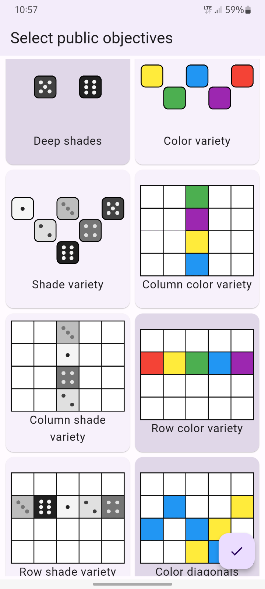
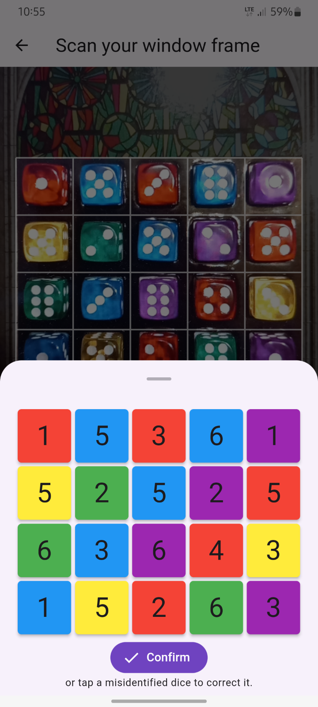
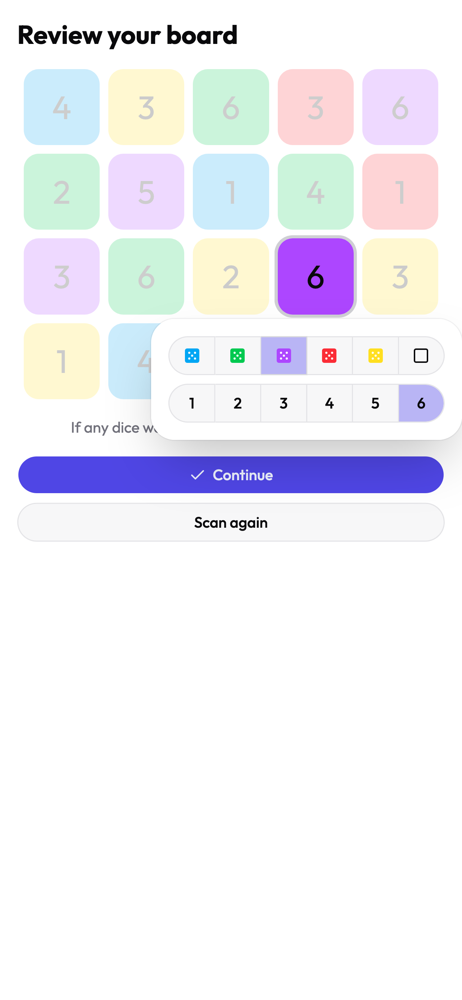
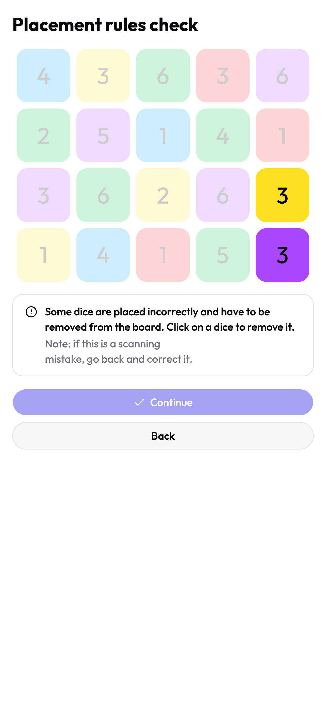
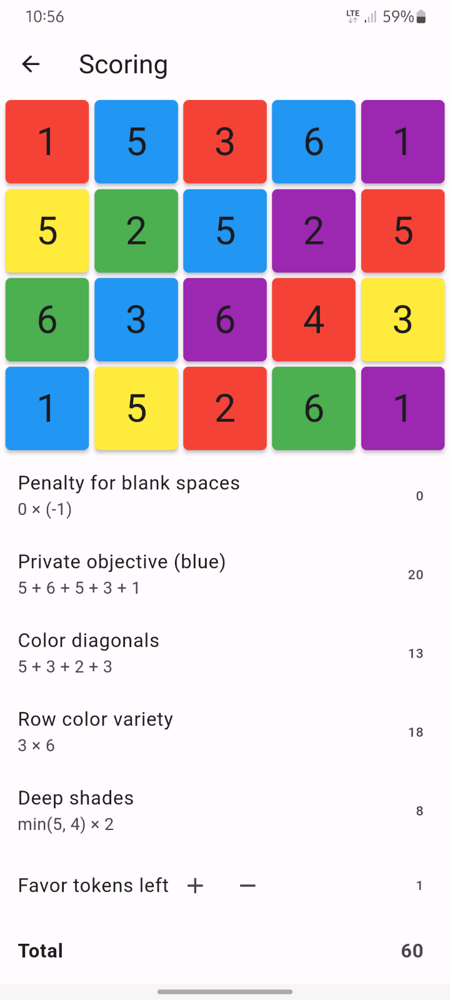

# Sagrada scoring assistant

## About

This is a web application for players of the board game [Sagrada](https://floodgate.games/products/sagrada), which helps with calculating the final scores. The scoring rules are complex and it's quite easy to make a mistake when calculating them by hand, but with this app it's no longer an issue. Just select the objectives you're playing with, take a photo your board and have the scoring computed automatically! Not only will you see the end result, but also a breakdown of points earned for each goal, with a visual indication of the dice contributing to the score and formula used to work it out.

Image recognition is carried out by two convolutional neural networks (one for reading numbers on the dice, one for colors), trained in TensorFlow on my own data and deployed as TF.js models – so the inference is done on the user's device, without the need to send anything to a server.

## Screenshots

| | | |
|-|-|-|
 |  |  |
|  |  |  |

## See it live

It's available on https://sagrada.mrozwadowski.com

If you'd like to check how scanning works, but don't have the real game, you can try opening a photo of the board ([here](https://boardgamegeek.com/image/3505621/sagrada) [are](https://boardgamegeek.com/image/3521516/sagrada) [some](https://boardgamegeek.com/image/3674958/sagrada) [exampes](https://boardgamegeek.com/image/3576214/sagrada)) on your computer and scan the picture on the screen with your phone.

## Project setup

```sh
git clone https://github.com/hejmsdz/sagrada
cd sagrada
npm install
npm run dev
```
