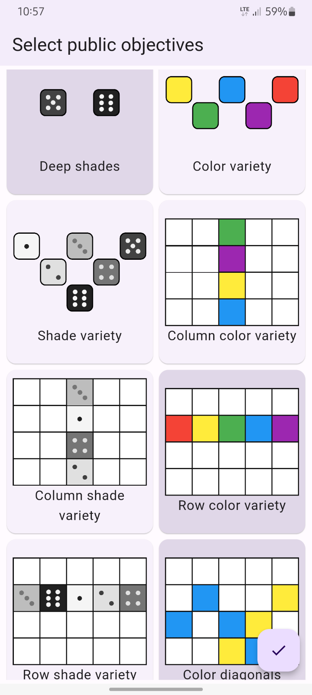
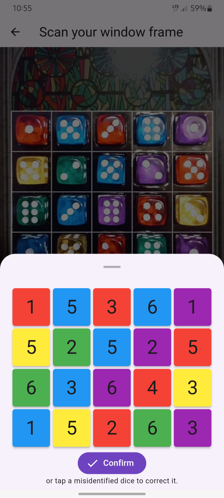
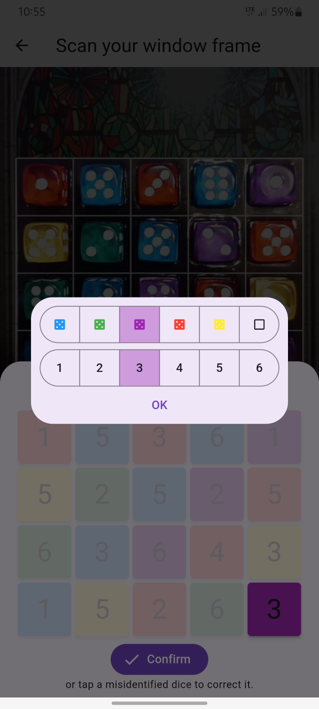
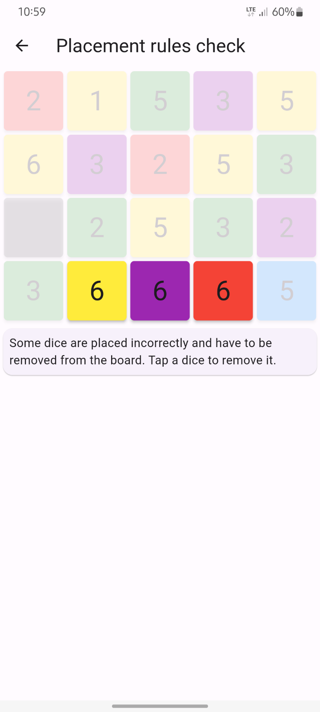
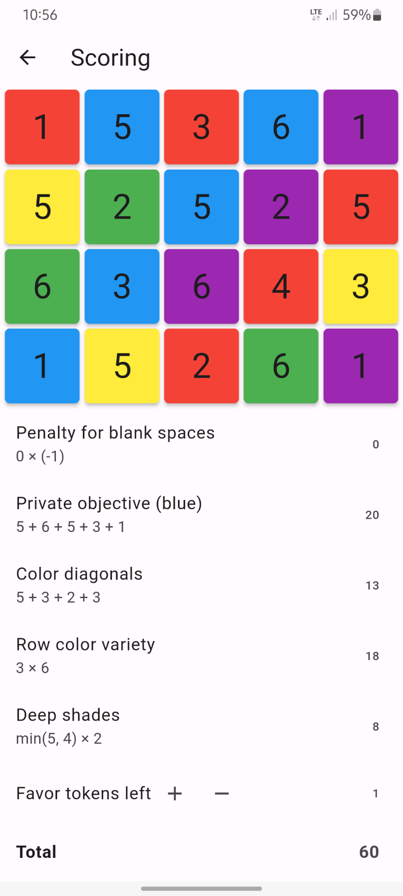
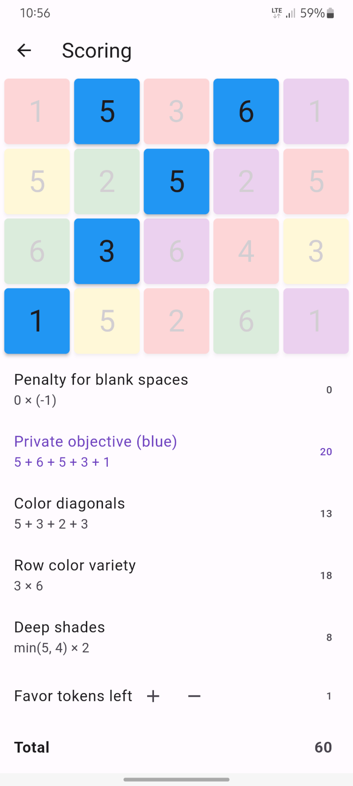

# Sagrada scoring app

This is a mobile application for players of the board game [Sagrada](https://floodgate.games/products/sagrada), that helps with calculating the final scores.
The scoring rules are complex and it's quite easy to make a mistake when calculating them by hand, but with this app it's no longer an issue.
Just select the objectives you're playing with, take a photo your board and have the scoring computed automatically! Not only will you see the end result, but also a breakdown of points earned for each goal, with a visual indication of the dice contributing to the score and formula used to work it out.

The UI is written in Flutter, so it should be compatible both with Android and iOS, though I only tested it on an Android phone so far.
Image recognition is carried out by two convolutional neural networks (one for reading numbers on the dice, one for colors), trained in TensorFlow on my own data and deployed as TensorFlow Lite models – so the inference is done on the user's phone, without the need to send anything to a server. I do, however, collect misidentified and manually corrected samples to improve the models.

The app is currently at an MVP stage. It does the job, but still I'm working on the user experience and accuracy of image recognition. Then I hope to release it to the Google Play store, so stay tuned!

## Screenshots

| Objective choice | Image recognition | Manual correction |
| ---------------- | ----------------- | ----------------- |
|  |  |  |

| Rules checking | Scoring view | Detailed scoring view |
| -------------- | ------------ | --------------------- |
|  |  | 
